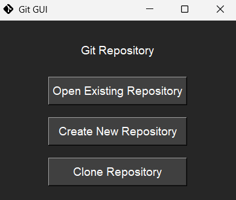
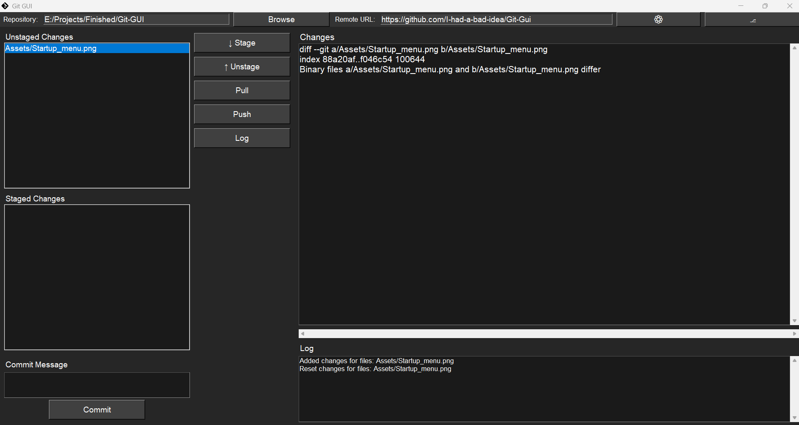
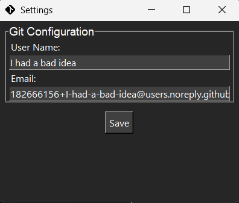
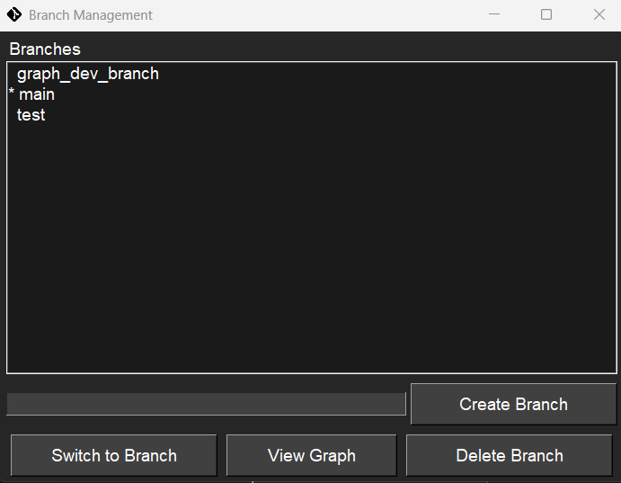

# Git GUI

A modern, user-friendly graphical interface for Git operations, built with Python. This tool simplifies Git operations through an intuitive graphical interface, making version control more accessible to users of all experience levels.

## Features

- **Simple Repository Management**
  - Open existing repositories
  - Create new repositories 
  - Clone remote repositories
  - Quick repository switching
  

- **Intuitive Interface**
  - Clear visibility of staged and unstaged changes
  - File-specific diff view
  - Command output log
  - Branch management
  

- **Core Git Operations**
  - Stage/unstage files
  - Commit changes with messages
  - Push to remote with automatic upstream tracking
  - Pull from remote
  - View file differences
  - Create/Delete/Switch branches
  - View your git history (log)
  - Branch management with remote synchronization

## Releases

The latest stable release can be downloaded from the [releases page](https://github.com/I-had-a-bad-idea/Git-Gui/releases). Each release includes:
- Windows executable (.exe)
- Release notes detailing changes and improvements

## Usage

1. Choose one of the following options:
   - Open an existing Git repository
   - Create a new Git repository
   - Clone a remote repository


2. Once a repository is opened, you can:
   - View staged and unstaged changes
   - Stage/unstage files using the arrow buttons
   - View file differences in the diff panel
   - Commit changes with a message
   - Push/pull changes to/from remote
   - Create/Delete/Switch branches
   - Get log data


## Requirements

- Python 3.x
- GitPython
- tkinter

## Configuration

Git configuration can be accessed through the settings menu (⚙):
- Set Git username
- Set Git email



## Branch Management

Branch operations can be accessed through the branch menu (⎇):
- Create new branches
- Delete branches (local and remote)
- Switch between branches
- View current active branch
- Automatic upstream tracking for new branches
- Remote branch synchronization



## Repository History

Text-based log showing:
 - Commit hashes
 - Author information
 - Commit messages
 - Timestamps


## Getting Help

- Check the [issues page](https://github.com/I-had-a-bad-idea/Git-Gui/issues) for known problems and solutions
- Submit bug reports or feature requests through GitHub issues

## Development

Want to contribute? Here's the project structure:

```
Git-Gui/
├── __main__.py           # Application entry point
├── git_interface/        # Git operations
│   ├── __init__.py
│   └── git_commands.py   # Git command implementations
├── GUI/                  # User interface
│   ├── __init__.py
│   ├── gui_window.py     # Main repository window
│   ├── startup_window.py # Initial selection window
│   ├── branch_window.py  # Branch management window
│   ├── graph_window.py   # History visualization (not implemented)
│   └── theme.py         # Styles
└── requirements.txt      # Project dependencies
```

## Contributing

1. Fork the repository
2. Create a feature branch ("git checkout -b feature/amazing-feature")
3. Commit your changes ("git commit -m 'Add some amazing feature'")
4. Push to the branch ("git push origin feature/amazing-feature")
5. Open a Pull Request

## License

[MIT License](LICENSE)

## Acknowledgments

- Built with [GitPython](https://gitpython.readthedocs.io/)
- UI powered by Python's tkinter
